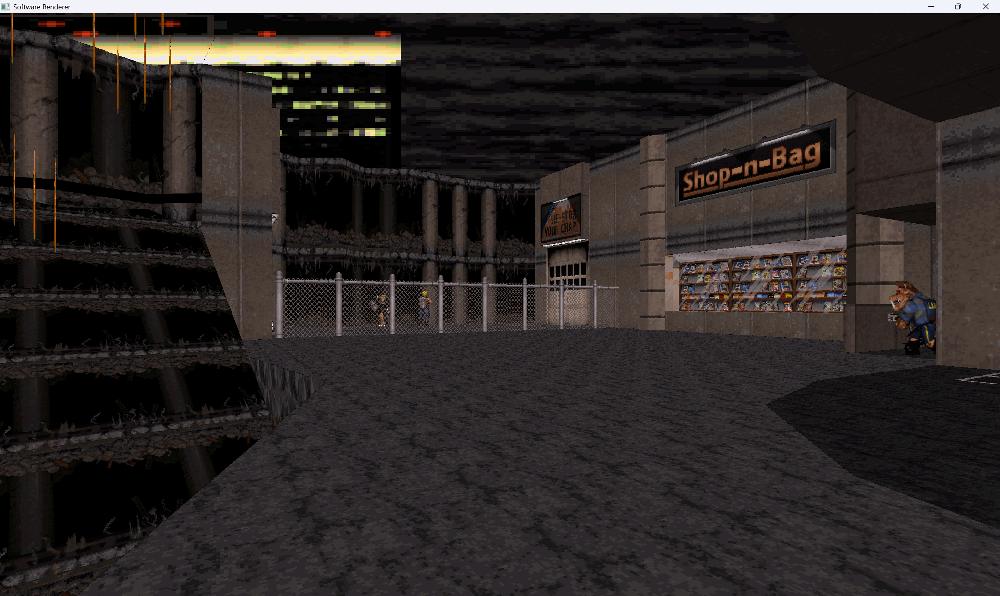
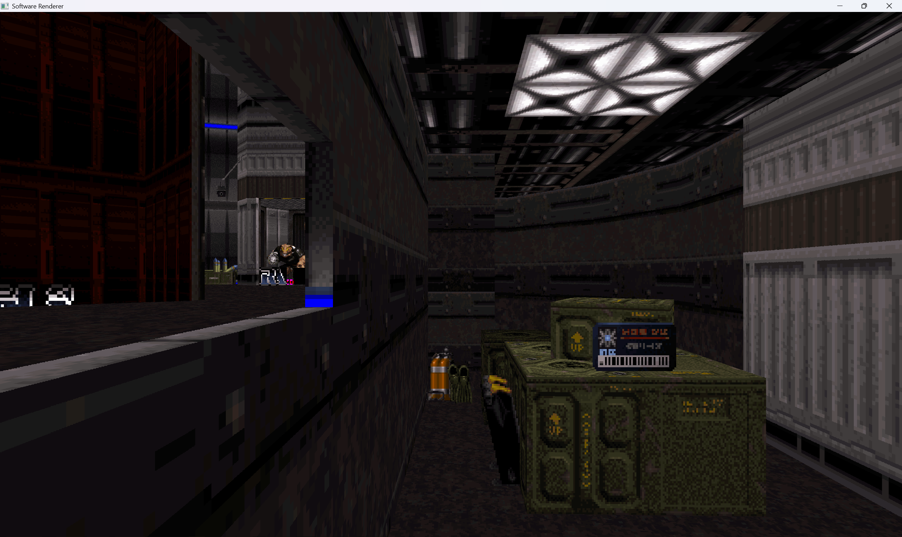
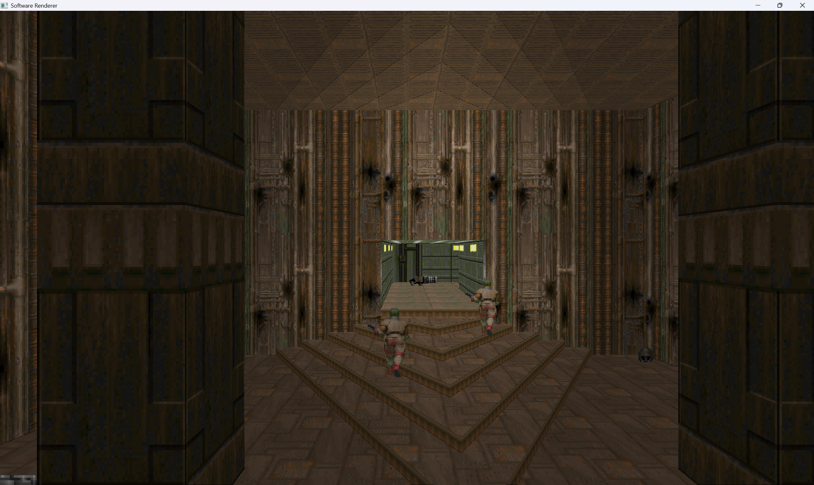
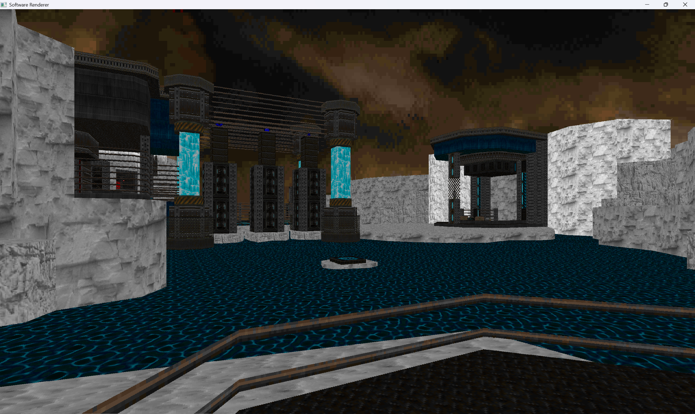

## Project Overview

**DotNetPortalRenderer** is a .NET 10 software-based portal rendering engine that renders maps from the Doom (ID Tech 1) and Build (Duke Nukem 3D) game engines. It implements a classic portal-based raycasting renderer—a rendering technique that divides 3D space into sectors (rooms) connected by portals (passages between rooms).

The renderer runs in software (no GPU rendering), using SIMD/vectorized operations for performance. It renders to a BGRA framebuffer that gets uploaded to an OpenGL texture each frame.

### Screenshots

|  |  |
|------------------------|------------------------|
|  |  |

### Project Structure

The solution contains 8 projects:

1. **RenderingEngine** - Core portal rendering library
   - Implements the `PortalRenderer` class (main rendering loop)
   - Portal-based sector traversal and depth-based rendering
   - Wall, floor, ceiling, and sprite rendering
   - Handles raycasting, texture mapping, and shading

2. **SoftwareRenderer** - Cross platform application
   - Uses OpenTK

3. **SoftwareRendererModels** - Shared data models

4. **DoomAssetLoader** - Doom WAD/PWAD file parsing
   - Supports both classic binary format and UDMF (text-based) maps

5. **BuildAssetLoader** - Duke Nukem 3D GRP file parsing
   - Loads GRP files and extracts maps, textures, sprites

6. **Tooling** - General-purpose utilities shared across projects

7. **Tests** - Unit tests (XUnit)

8. **Benchmark** - Performance benchmarks (BenchmarkDotNet)
   - Benchmarks for rendering operations, vector operations, and math functions

### Rendering Pipeline

The core rendering happens in `PortalEngine` and `GameRenderingThread`:

1. **PortalEngine** (`Engine/PortalEngine.cs`)
   - Manages game state and player position
   - Handles keyboard input for camera movement and rotation
   - Orchestrates game loop startup via `GameRenderingThread`

2. **GameRenderingThread** (`Engine/GameRenderingThread.cs`)
   - Runs renderer on a background thread (long-running task)
   - Synchronizes frame rendering with main UI thread via semaphores
   - Returns BGRA framebuffer pointer for OpenGL texture upload

3. **PortalRenderer** (`Engine/Engine/Renderer/PortalRenderer.cs`)
   - Main rendering implementation
   - **Key method: `DrawScreen()`** - Portal-based depth-first rendering:
     1. Start with player's sector
     2. For each depth level: render all walls in queued sectors
     3. Calculate visible floor/ceiling bounds using raycasting
     4. Render floors and ceilings within visible bounds
     5. Identify portal walls and queue connected sectors for next depth
     6. After all walls: render sprites and transparent textures

### Running

```bash
# Load a Doom map
dotnet run --project SoftwareRenderer -- --map E1M1 --iwad /path/to/doom.wad

# Load a Doom map with custom PWAD
dotnet run --project SoftwareRenderer -- --map E1M1 --iwad /path/to/doom.wad --pwad /path/to/custom.wad

# Load a Duke Nukem 3D map
dotnet run --project SoftwareRenderer -- --map E1L2 --grp /path/to/duke3d/folder
```

### FAQ

**Why?** 

To learn how to write high performance C# code, to learn SIMD, and learn how old games rendered their environments.

**Is this a port of ID Tech or Build Enine to C#?**

No. This is largely my own work / design.

### AI Use Disclosure

Majority of the application and the rendering design are handmade.

AI tools are used for,
- Code Review and optimization recommendation. Such as "Native" methods and pointing me towards the Avx2 instructions.
- Help with algorithms, such as slope calculations.
- Documentation.
- Unit test generation.
